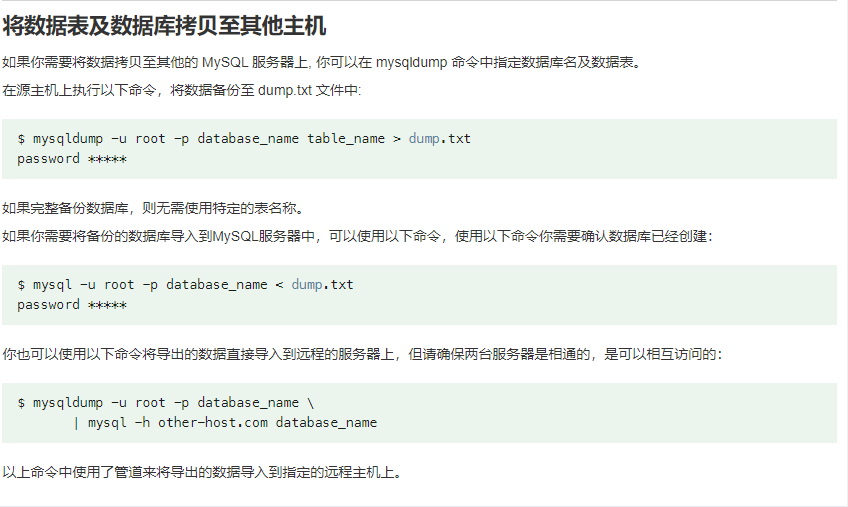

# mysql修改初始密码

```sql
alter user 'root'@'localhost' identified by 'ApKyLoQy38plBhK1oOv!v';
```

# mysql导入导出

## 导出

```bash
mysqldump -u root -p mydatabase > mydatabase_backup.sql
```

## 导入

```bash
mysqldump -u root -p mydatabase < mydatabase_backup.sql
```

### 导出导入示例



# mysql用户管理

## 创建用户

```sql
create user upstream@'66.77.2.3' identified by '3rbxXzrhM8!';
```

创建一个名称为‘upstream’密码为‘3rbxXzrhM8!’的用户，允许登录范围为‘66.77.2.3’

## 授权数据库给用户

## 执行SQL语句并将日志定向到标准输出

```shell
mysql -u 用户名 -p 数据库名 --verbose < /path/to/script.sql

# 示例
mysql -u root -p heyue_stock_quotes --verbose < /opt/data/2024.7.3/index_nasdaq.sql
```

## 生成清空数据库中所有表数据的命令

```shell
# -D指定数据库 -e要执行的sql语句  \`转义table_name中出现的特殊符号
mysql -uroot -p -D your_database_name -e "select concat('TRUNCATE TABLE \`', table_name, '\`;') from information_schema.tables where table_schema = 'your_database_name';" > truncate_tables.sql

# 执行.sql文件清空表
mysql -u root -p your_database_name < truncate_tables.sql
```